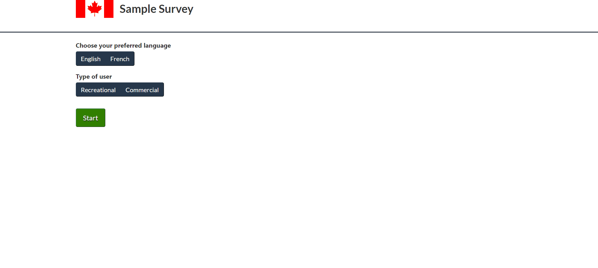

**[You can check out the project here](https://survey-sajadi.netlify.app/)**

## Final Product

## Project Stack

- React
- TypeScript

## Project Features

- Users can choose their preferred language
- Users can see a summary of their answers before the survey submssion

## Available Scripts

In the project directory, you can run:

### `yarn start`

Runs the app in the development mode. 
Open [http://localhost:3000](http://localhost:3000) to view it in the browser.

The page will reload if you make edits. 
You will also see any lint errors in the console.
